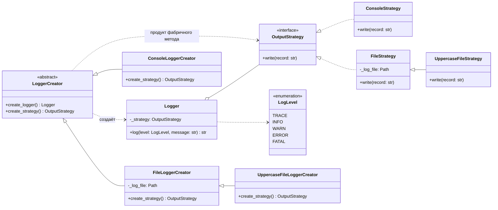

# Структурная диаграмма

```mermaid
classDiagram
    direction LR

    class OutputStrategy {
        <<interface>>
        +write(record: str)
    }

    class ConsoleStrategy {
        +write(record: str)
    }

    class FileStrategy {
        -_log_file: Path
        +write(record: str)
    }

    class UppercaseFileStrategy {
        +write(record: str)
    }

    class Logger {
        -_strategy: OutputStrategy
        +log(level: LogLevel, message: str) str
    }

    class LogLevel {
        <<enumeration>>
        TRACE
        INFO
        WARN
        ERROR
        FATAL
    }

    class LoggerCreator {
        <<abstract>>
        +create_logger() Logger
        +create_strategy() OutputStrategy
    }

    class ConsoleLoggerCreator {
        +create_strategy() OutputStrategy
    }

    class FileLoggerCreator {
        -_log_file: Path
        +create_strategy() OutputStrategy
    }

    class UppercaseFileLoggerCreator {
        +create_strategy() OutputStrategy
    }

    OutputStrategy <|.. ConsoleStrategy
    OutputStrategy <|.. FileStrategy
    FileStrategy <|-- UppercaseFileStrategy
    Logger o-- OutputStrategy
    Logger ..> LogLevel
    LoggerCreator <|-- ConsoleLoggerCreator
    LoggerCreator <|-- FileLoggerCreator
    FileLoggerCreator <|-- UppercaseFileLoggerCreator
    LoggerCreator ..> Logger : создаёт
    LoggerCreator ..> OutputStrategy : продукт фабричного метода
```
